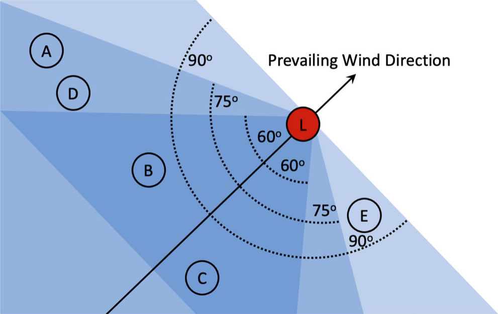
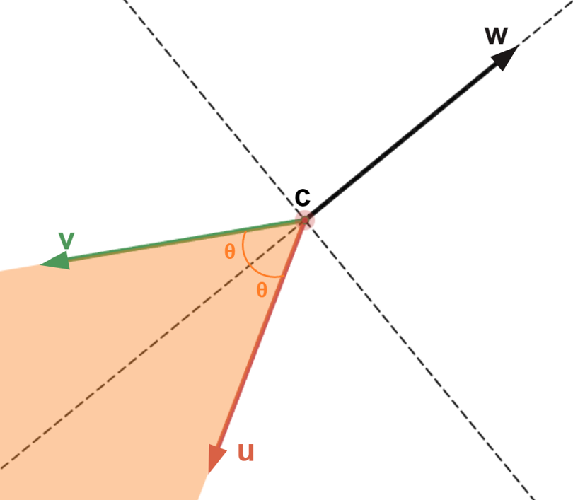

# Wind data scripts

These python scripts allow to extract and do stuff with wind data from the AGC dataset. Since the original dataset is *way* too big, the already extracted *AGC_wind_data.csv* dataset is uploaded to the repo for quick execution.

The scripts and their functions are:

- **extract_wind_data.py**: extracts from *AGC_Dataset_v_3_0_0.csv* the columns used for wind analysis and creates the file *AGC_Wind_Data.csv*. This file should already be available in the repository so this python script should not be necessary.
- **convert_wind_data.py**: converts cathegorical data in *AGC_Wind_Data.csv* to numerical data for processing and creates the file *Converted_AGC_Wind_Data.csv*
- **aggregate_wind_data.py**: aggregates time series data from *Converted_AGC_Wind_Data.csv* into point data for each point in the grid and creates the file *Aggregated_wind_data.csv*

# Wind adjacency algorithm

It's an implementation of what Kim did in [the paper](https://doi.org/10.1080/00949655.2022.2102633). It builds an adjacency matrix in which adjacency between a given point and any other is considered present if the second point is inside an area determined by the prevailing wind speed at the first point and by an arbitrary angle parameter.

In the above image, if we consider 60° as the angle parameter, we'll have that _L_ is adjacent only to _B_ and _C_ (note that adjacency is a **symmetric** relationship). If we instead consider 75°, then _A_ and _D_ will **also** be considered adjacent to _L_. Note that in this case the distance between points is not considered. The distance matrix will be automatically selected by the SBART algorithm and used as a weight for this wind adjacency matrix.

To compute whether a point is in the cone of influence, we must use some linear algebra. I'm sure there is a better way, but this is all I could think.

Let $\mathbf{c} = (c_x, c_y)$ be a point on the map, $\mathbf{w} = (w_x, w_y)$ the prevailing wind vector in that point and $\theta$ the angle parameter. Then we can define two other vectors $\mathbf{u}$ and $\mathbf{v}$ in this way:
$$
    \mathbf{u} = \left(
        \begin{array}{cc}
            \cos{\theta} & -\sin{\theta}\\
            \sin{\theta} & \cos{\theta}
        \end{array}
        \right)(-\mathbf{w}) =
        \left(
        \begin{array}{cc}
            -\cos{\theta} & \sin{\theta}\\
            -\sin{\theta} & -\cos{\theta}
        \end{array}
        \right)\mathbf{w} = 
        \left(
        \begin{array}{c}
            -w_x\cos{\theta} + w_y\sin{\theta}\\
            -w_x\sin{\theta} - w_y\cos{\theta}
        \end{array}
        \right)
$$
$$
    \mathbf{v} = \left(
        \begin{array}{cc}
            \cos{(-\theta)} & -\sin{(-\theta)}\\
            \sin{(-\theta)} & \cos{(-\theta)}
        \end{array}
        \right)(-\mathbf{w}) = 
        \left(
        \begin{array}{cc}
            -\cos{\theta} & -\sin{\theta}\\
            \sin{\theta} & -\cos{\theta}
        \end{array}
        \right)\mathbf{w} = 
        \left(
        \begin{array}{c}
            -w_x\cos{\theta} - w_y\sin{\theta}\\
            +w_x\sin{\theta} - w_y\cos{\theta}
        \end{array}
        \right)
$$

Note that the matrix $\left( \matrix{\cos{\theta} & -\sin{\theta} \cr \sin{\theta} & \cos{\theta}}\right)$ is the **transformation matrix** that rotates the points in the plane counterclockwise through an angle of $\theta$ about the origin. The vectors obtained are represented in the image below:

With these two vectors ($\mathbf{u}$ and $\mathbf{v}$) we can define the points in the shaded area:

A point $\mathbf{d}$ is adjacent to $\mathbf{c}$ (is in the shaded area) if there exist two **non-negative** numbers $s$ and $t$ such that:
$$
    \mathbf{d} = \mathbf{c} + s \mathbf{u} + t \mathbf{v}
$$
If we define $\mathbf{d'} = \mathbf{d}-\mathbf{c} = (x,y)$ and we expand the expression, we can rewrite it as a $2\times 2$ linear system.
$$
    \left(
        \begin{array}{cc}
            -w_x\cos{\theta} + w_y\sin{\theta} & -w_x\cos{\theta} - w_y\sin{\theta}\\
            -w_x\sin{\theta} - w_y\cos{\theta} & +w_x\sin{\theta} - w_y\cos{\theta}
        \end{array}
    \right)
    \left(
        \begin{array}{c}
            s \\
            t
        \end{array}
    \right)
    =
    \left(
        \begin{array}{c}
            x \\
            y
        \end{array}
    \right)
$$
Notice that as long as $\theta$ is between $0$ and $\pi/2$ both excluded, then $u$ and $v$ are linearly indipendent and so the system admits a unique solution given by the expression below.
$$
    \left(
        \begin{array}{c}
            s \\
            t
        \end{array}
    \right)
    =
    \left(
        \begin{array}{cc}
            -w_x\cos{\theta} + w_y\sin{\theta} & -w_x\cos{\theta} - w_y\sin{\theta}\\
            -w_x\sin{\theta} - w_y\cos{\theta} & +w_x\sin{\theta} - w_y\cos{\theta}
        \end{array}
    \right)^{-1}
    \left(
        \begin{array}{c}
            x \\
            y
        \end{array}
    \right)
$$
The matrix is always invertible and is equal to...
$$
    \left(
        \begin{array}{cc}
            -w_x\cos{\theta} + w_y\sin{\theta} & -w_x\cos{\theta} - w_y\sin{\theta}\\
            -w_x\sin{\theta} - w_y\cos{\theta} & +w_x\sin{\theta} - w_y\cos{\theta}
        \end{array}
    \right)^{-1} = 
    \frac{1}{-(w_x^2+w_y^2)\sin{(2\theta)}}
    \left(
        \begin{array}{cc}
            w_x\sin{\theta} - w_y\cos{\theta} & w_x\cos{\theta} + w_y\sin{\theta}\\
            w_x\sin{\theta} + w_y\cos{\theta} & w_y\sin{\theta}-w_x\cos{\theta}
        \end{array}
    \right)
$$ 
If the components of the solution are all non negative, then $\mathbf{d}$ is in the shaded region and therefore adjacent to $\mathbf{c}$, otherwise no.